# 🚀 FastMCP - Gestor de Tareas y Citas

  

**Un servidor MCP (Model Context Protocol) completo para gestión inteligente de tareas y citas, construido con FastMCP framework.**

---

## 📋 Índice

1. [¿Qué es este proyecto?](#-qué-es-este-proyecto)
2. [¿Qué es FastMCP y MCP?](#-qué-es-fastmcp-y-mcp)
3. [Arquitectura del Proyecto](#-arquitectura-del-proyecto)
4. [Instalación y Configuración](#-instalación-y-configuración)
5. [Tutorial Paso a Paso](#-tutorial-paso-a-paso)
6. [Estructura del Código](#-estructura-del-código)
7. [Herramientas Disponibles](#-herramientas-disponibles)
8. [Modos de Ejecución](#-modos-de-ejecución)
9. [Docker y Despliegue](#-docker-y-despliegue)
10. [Cómo Replicar Exactamente](#-cómo-replicar-exactamente)
11. [Resolución de Problemas](#-resolución-de-problemas)

---

## 🎯 ¿Qué es este proyecto?

Este proyecto es un **servidor MCP (Model Context Protocol)** que proporciona herramientas inteligentes para la gestión de tareas y citas. Permite a los modelos de lenguaje (LLMs) como Claude, ChatGPT o cualquier cliente MCP interactuar de forma natural con un sistema de gestión personal/empresarial.

### ✨ Características principales:

- **13 herramientas MCP** para tareas y citas
- **Soporte dual**: HTTP y stdio transport
- **Backend agnóstico**: Se conecta a cualquier API REST
- **Gestión de tareas**: Crear, listar, actualizar, eliminar, completar
- **Gestión de citas**: Programar, verificar disponibilidad, actualizar, cancelar
- **Configuración flexible**: Variables de entorno y archivos .env
- **Dockerizado**: Listo para producción
- **Compatible con Cursor/Claude Desktop**: Integración directa

---

## 🔧 ¿Qué es FastMCP y MCP?

### Model Context Protocol (MCP)

MCP es un **protocolo estándar** desarrollado por Anthropic que permite a los modelos de lenguaje (LLMs) conectarse de forma segura y eficiente con datos y funcionalidades externas. Es el "puente" entre la IA y tus aplicaciones.

**¿Por qué MCP?**
- **Estandarización**: Un protocolo único para todas las integraciones
- **Seguridad**: Comunicación controlada y auditada
- **Eficiencia**: Transferencia optimizada de contexto
- **Escalabilidad**: Arquitectura cliente-servidor robusta

### FastMCP Framework

**FastMCP** (por Jeff Lowin - @jlowin) es un framework Python que simplifica enormemente la creación de servidores MCP. Es como "FastAPI para MCP".

**¿Por qué elegimos FastMCP?**
- **Pythónico**: Sintaxis limpia y familiar
- **Rápido desarrollo**: Decoradores simples para herramientas
- **Múltiples transportes**: HTTP, stdio, SSE automáticamente
- **Configuración enterprise**: Autenticación, logging, deployment
- **Comunidad activa**: 9.3/10 trust score, 1000+ code snippets

```python
# ¡Crear un servidor MCP es así de simple!
from fastmcp import FastMCP

mcp = FastMCP("Mi Servidor")

@mcp.tool
def saludar(nombre: str) -> str:
    """Saluda a alguien"""
    return f"¡Hola {nombre}!"

if __name__ == "__main__":
    mcp.run()  # ¡Ya tienes un servidor MCP!
```

---

## 🏗 Arquitectura del Proyecto

```mermaid
graph TB
    subgraph "Cliente MCP (Cursor/Claude)"
        C[Cliente MCP]
    end
    
    subgraph "FastMCP Server"
        M[main.py<br/>Servidor FastMCP]
        T[tools/task_tools.py<br/>Herramientas Tareas]
        A[tools/appointment_tools.py<br/>Herramientas Citas]
        CFG[config.py<br/>Configuración]
    end
    
    subgraph "Backend API"
        B[API REST Backend<br/>http://localhost:8002]
        DB[(Base de Datos)]
    end
    
    C <-->|MCP Protocol<br/>HTTP/stdio| M
    M --> T
    M --> A
    M --> CFG
    T -->|HTTP Requests| B
    A -->|HTTP Requests| B
    B --> DB
```



### 🔄 Flujo de Comunicación

1. **Cliente MCP** (Cursor, Claude Desktop) envía solicitud
2. **FastMCP Server** recibe y procesa la solicitud MCP
3. **Tools** (task_tools/appointment_tools) ejecutan la lógica
4. **Backend API** almacena/recupera datos de la base de datos
5. **Respuesta MCP** regresa al cliente con los resultados

---

## 🛠 Instalación y Configuración

### Prerrequisitos

```bash
# Python 3.11 o superior
python --version  # >= 3.11

# pip para instalar dependencias
pip --version

# curl para verificaciones (opcional)
curl --version
```

### 1. Clonar y Preparar

```bash
# Clonar el repositorio
git clone <tu-repositorio>
cd fastmcp

# Crear entorno virtual
python -m venv venv

# Activar entorno virtual
# En Linux/Mac:
source venv/bin/activate
# En Windows:
# venv\Scripts\activate

# Instalar dependencias
pip install -r requirements.txt
```

### 2. Configurar Variables de Entorno

```bash
# Crear archivo de configuración
cp .env.example .env

# Editar con tus valores
nano .env  # o code .env
```

### 3. Verificar Backend

```bash
# El servidor necesita un backend API corriendo
# Verificar que está disponible:
curl http://localhost:8002/health

# Si no tienes backend, el servidor mostrará warnings pero funcionará
```

---

## 📚 Tutorial Paso a Paso

### Paso 1: Configuración Inicial

**1.1. Crear archivo .env**

```bash
# Archivo: .env
MCP_HOST=0.0.0.0
MCP_PORT=8001
MCP_TRANSPORT=http
BACKEND_URL=http://localhost:8002
CORS_ORIGINS=*
DEBUG=true
FORCE_HTTP_MODE=false
REQUEST_TIMEOUT=5
AGENT_TIMEOUT=3
LOG_LEVEL=INFO
```

**1.2. Instalar dependencias**

```bash
pip install fastmcp requests pydantic aiofiles fastapi uvicorn python-dotenv
```

### Paso 2: Entender la Estructura

**2.1. Archivo principal (main.py)**

```python
# main.py es el corazón del servidor
from fastmcp import FastMCP

# Crear servidor FastMCP
mcp = FastMCP("Gestor Tareas y Citas MCP")

# Decorador @mcp.tool convierte función Python en herramienta MCP
@mcp.tool
def create_task(title: str, description: str = "") -> dict:
    """Crear una nueva tarea"""
    return task_tools.create_task(title, description)
```

**2.2. Herramientas de Tareas (tools/task_tools.py)**

```python
# task_tools.py maneja toda la lógica de tareas
class TaskTool:
    @staticmethod
    def create_task(title: str, description: str = "") -> dict:
        # Hace llamada HTTP al backend API
        response = requests.post(f"{BACKEND_URL}/tasks/", json=data)
        return response.json()
```

### Paso 3: Ejecutar el Servidor

**3.1. Modo de desarrollo**

```bash
# Ejecutar directamente
python main.py

# O usando el script
chmod +x run_fastmcp.sh
./run_fastmcp.sh
```

**3.2. Verificar funcionamiento**

```bash
# Verificar servidor HTTP
curl http://localhost:8001/health

# Ver herramientas disponibles
curl http://localhost:8001/tools

# Llamar una herramienta
curl -X POST http://localhost:8001/tools/create_task \
     -H "Content-Type: application/json" \
     -d '{"title": "Mi primera tarea"}'
```

### Paso 4: Integrar con Cliente MCP

**4.1. Para Claude Desktop**

Editar `~/AppData/Roaming/Claude/claude_desktop_config.json` (Windows) o `~/.claude/claude_desktop_config.json` (Mac):

```json
{
  "mcpServers": {
    "fastmcp-tareas": {
      "command": "python",
      "args": ["/ruta/absoluta/al/main.py"],
      "env": {
        "MCP_TRANSPORT": "stdio"
      }
    }
  }
}
```

**4.2. Para Cursor**

Agregar al archivo de configuración MCP de Cursor:

```json
{
  "mcpServers": {
    "fastmcp-tareas": {
      "command": "python",
      "args": ["/ruta/absoluta/al/main.py"]
    }
  }
}
```

---

## 📁 Estructura del Código

### Descripción de cada archivo:

```
fastmcp/
├── main.py                    # 🎯 Servidor FastMCP principal
├── config.py                  # ⚙️  Configuración y variables
├── requirements.txt           # 📦 Dependencias Python
├── Dockerfile                 # 🐳 Configuración Docker
├── run_fastmcp.sh            # 🚀 Script de ejecución
├── __init__.py               # 📝 Archivo de módulo Python
└── tools/                    # 🛠️ Herramientas MCP
    ├── __init__.py           # 📝 Inicializador de módulo
    ├── task_tools.py         # ✅ Herramientas de tareas
    └── appointment_tools.py  # 📅 Herramientas de citas
```

### 🎯 main.py - El Servidor Principal

**Propósito**: Punto de entrada del servidor FastMCP que define todas las herramientas MCP.

**Funciones clave**:
- Inicializa servidor FastMCP
- Define 13 herramientas MCP usando decorador `@mcp.tool`
- Maneja detección automática de modo (stdio vs HTTP)
- Configura CORS y middleware para HTTP
- Proporciona endpoints de salud y listado de herramientas

```python
# Estructura básica
mcp = FastMCP("Gestor Tareas y Citas MCP")

# Herramientas de tareas
@mcp.tool
def create_task(...): pass
@mcp.tool  
def list_tasks(...): pass
# ... más herramientas

# Herramientas de citas
@mcp.tool
def schedule_appointment(...): pass
# ... más herramientas

# Auto-detección de modo
if __name__ == "__main__":
    # stdio para clientes MCP, HTTP para testing
    if not sys.stdin.isatty():
        mcp.run()  # modo stdio
    else:
        # modo HTTP con FastAPI wrapper
```

### ⚙️ config.py - Configuración Central

**Propósito**: Centraliza toda la configuración usando variables de entorno.

**Variables importantes**:
```python
MCP_HOST = "0.0.0.0"           # Host del servidor
MCP_PORT = 8001                # Puerto del servidor  
MCP_TRANSPORT = "http"         # Modo de transporte
BACKEND_URL = "http://localhost:8002"  # API backend
REQUEST_TIMEOUT = 5            # Timeout para requests
CORS_ORIGINS = ["*"]           # Orígenes CORS permitidos
DEBUG = False                  # Modo debug
```

### 🛠️ tools/task_tools.py - Herramientas de Tareas

**Propósito**: Implementa todas las operaciones CRUD para tareas.

**Métodos principales**:
- `create_task()`: Crear nueva tarea
- `list_tasks()`: Listar con filtros opcionales  
- `update_task()`: Actualizar campos específicos
- `delete_task()`: Eliminar tarea
- `complete_task()`: Marcar como completada
- `get_task()`: Obtener tarea específica

**Patrón de implementación**:
```python
@staticmethod
def create_task(title: str, ...) -> dict:
    try:
        # Preparar datos
        task_data = {"title": title, ...}
        
        # Llamada HTTP al backend
        response = requests.post(
            f"{BACKEND_URL}/tasks/",
            json=task_data,
            params={"user_id": "default-user"},
            timeout=5
        )
        response.raise_for_status()
        return response.json()
    except requests.exceptions.RequestException as e:
        return {"error": f"Error al crear tarea: {str(e)}"}
```

### 📅 tools/appointment_tools.py - Herramientas de Citas

**Propósito**: Gestiona operaciones de calendario y citas.

**Métodos principales**:
- `schedule_appointment()`: Programar nueva cita
- `check_availability()`: Verificar disponibilidad de horario
- `list_appointments()`: Listar citas con filtros
- `update_appointment()`: Modificar cita existente  
- `cancel_appointment()`: Cancelar cita
- `delete_appointment()`: Eliminar permanentemente

**Características especiales**:
- Manejo de zonas horarias ISO
- Cálculo automático de duración
- Verificación de conflictos de horario
- Soporte para participantes múltiples

---

## 🔧 Herramientas Disponibles

### 📋 Herramientas de Tareas

| Herramienta | Descripción | Parámetros |
|-------------|-------------|------------|
| `create_task` | Crear nueva tarea | `title*`, `description`, `due_date`, `priority`, `category`, `tags` |
| `list_tasks` | Listar tareas con filtros | `status`, `priority`, `category` |
| `update_task` | Actualizar tarea existente | `task_id*`, campos opcionales |
| `delete_task` | Eliminar tarea | `task_id*` |
| `complete_task` | Marcar como completada | `task_id*` |
| `get_task_summary` | Resumen estadístico | ninguno |

### 📅 Herramientas de Citas

| Herramienta | Descripción | Parámetros |
|-------------|-------------|------------|
| `schedule_appointment` | Programar nueva cita | `title*`, `start_time*`, `duration_minutes`, `description`, `location`, `participants` |
| `check_availability` | Verificar disponibilidad | `start_time*`, `end_time*` |
| `list_appointments` | Listar citas | `date`, `status` |
| `update_appointment` | Actualizar cita | `appointment_id*`, campos opcionales |
| `cancel_appointment` | Cancelar cita | `appointment_id*` |

### 📊 Herramientas de Información

| Herramienta | Descripción | Propósito |
|-------------|-------------|-----------|
| `get_appointment_summary` | Estadísticas de citas | Dashboard y reporting |
| `get_all_data` | Todos los datos | Backup y análisis |

**Leyenda**: `*` = parámetro requerido

---

## ⚡ Modos de Ejecución

### 1. Modo Stdio (Para Clientes MCP)

```bash
# Configurar en .env
MCP_TRANSPORT=stdio

# Ejecutar
python main.py

# O forzar stdio
echo "" | python main.py
```

**Características**:
- Comunicación vía stdin/stdout
- Protocolo MCP binario
- Usado por Cursor, Claude Desktop
- Sin logs en stdout (no interfiere)

### 2. Modo HTTP (Para Testing/API)

```bash
# Configurar en .env  
MCP_TRANSPORT=http
MCP_PORT=8001

# Ejecutar
python main.py
```

**Endpoints disponibles**:
```bash
GET  /health                    # Estado del servidor
GET  /tools                     # Lista de herramientas
POST /tools/{tool_name}         # Ejecutar herramienta
GET  /mcp                       # Endpoint MCP nativo
```

### 3. Modo Docker

```bash
# Construir imagen
docker build -t fastmcp .

# Ejecutar contenedor
docker run -p 8001:8001 \
  -e BACKEND_URL=http://host.docker.internal:8002 \
  fastmcp
```

### 4. Auto-detección Inteligente

El servidor detecta automáticamente el modo según:

```python
# Lógica de detección en main.py
if transport_env == "stdio" or (not force_http and not sys.stdin.isatty()):
    mcp.run()  # Modo stdio
else:
    # Modo HTTP con FastAPI wrapper
    uvicorn.run(http_app, host=MCP_HOST, port=MCP_PORT)
```

**Casos de uso**:
- Terminal TTY → Modo HTTP (para debugging)
- Pipe/Cliente MCP → Modo stdio (para producción)
- `FORCE_HTTP_MODE=true` → Siempre HTTP

---

## 🐳 Docker y Despliegue

### Dockerfile Explicado

```dockerfile
FROM python:3.11-slim      # Imagen base ligera
WORKDIR /app               # Directorio de trabajo
COPY requirements.txt .    # Copiar dependencias
RUN pip install --no-cache-dir -r requirements.txt  # Instalar
COPY . .                   # Copiar código fuente
EXPOSE 8001                # Puerto de exposición
CMD ["python", "main.py"]  # Comando de inicio
```

### Docker Compose (Recomendado)

```yaml
# docker-compose.yml
version: '3.8'
services:
  fastmcp:
    build: .
    ports:
      - "8001:8001"
    environment:
      - MCP_TRANSPORT=http
      - BACKEND_URL=http://backend:8002
      - FORCE_HTTP_MODE=true
    depends_on:
      - backend
      
  backend:
    image: tu-backend-api:latest
    ports:
      - "8002:8002"
    environment:
      - DATABASE_URL=postgresql://...
```

### Despliegue en Producción

```bash
# 1. Variables de entorno
export MCP_HOST=0.0.0.0
export MCP_PORT=8001
export BACKEND_URL=https://tu-api.com
export MCP_TRANSPORT=http

# 2. Usar servidor ASGI robusto
pip install gunicorn
gunicorn -w 4 -k uvicorn.workers.UvicornWorker main:http_app

# 3. O usar uvicorn directamente
uvicorn main:http_app --host 0.0.0.0 --port 8001 --workers 4
```

---

## 🔄 Cómo Replicar Exactamente

### Opción A: Replicación Completa

```bash
# 1. Clonar estructura
mkdir mi-fastmcp && cd mi-fastmcp
mkdir tools

# 2. Crear archivos base
touch main.py config.py requirements.txt Dockerfile run_fastmcp.sh
touch __init__.py tools/__init__.py tools/task_tools.py tools/appointment_tools.py

# 3. Copiar dependencias
cat > requirements.txt << 'EOF'
fastmcp
requests
pydantic
aiofiles
fastapi
uvicorn[standard]
python-dotenv
EOF

# 4. Copiar configuración
cat > .env << 'EOF'
MCP_HOST=0.0.0.0
MCP_PORT=8001
MCP_TRANSPORT=http
BACKEND_URL=http://localhost:8002
CORS_ORIGINS=*
DEBUG=true
FORCE_HTTP_MODE=false
REQUEST_TIMEOUT=5
AGENT_TIMEOUT=3
LOG_LEVEL=INFO
EOF

# 5. Instalar y ejecutar
pip install -r requirements.txt
python main.py
```

### Opción B: Adaptación Personalizada

**Para tu propio dominio**:

1. **Cambiar el dominio en task_tools.py**:
```python
# En lugar de tareas, usar tus entidades
class ProductTool:  # Para gestión de productos
    def create_product(self, name: str, price: float):
        # Tu lógica específica
```

2. **Actualizar main.py**:
```python
@mcp.tool
def create_product(name: str, price: float) -> dict:
    """Crear nuevo producto"""
    return product_tools.create_product(name, price)
```

3. **Modificar backend URL**:
```python
BACKEND_URL = "https://tu-api.com/api/v1"
```

### Opción C: Usando FastMCP CLI (Recomendado)

```bash
# 1. Instalar FastMCP
pip install fastmcp

# 2. Crear servidor base
cat > mi_servidor.py << 'EOF'
from fastmcp import FastMCP

mcp = FastMCP("Mi Servidor")

@mcp.tool
def mi_herramienta(param: str) -> str:
    """Mi primera herramienta"""
    return f"Procesé: {param}"

if __name__ == "__main__":
    mcp.run()
EOF

# 3. Crear configuración
cat > fastmcp.json << 'EOF'
{
  "$schema": "https://gofastmcp.com/schemas/fastmcp_config/v1.json",
  "entrypoint": {
    "file": "mi_servidor.py",
    "object": "mcp"
  },
  "environment": {
    "dependencies": ["requests", "pydantic"]
  },
  "deployment": {
    "transport": "http",
    "port": 8001
  }
}
EOF

# 4. Ejecutar
fastmcp run
```

---

## 🔧 Resolución de Problemas

### ❌ Problemas Comunes

**1. Error: "Backend not available"**
```bash
# Verificar backend
curl http://localhost:8002/health

# Solución: Ajustar URL en .env
BACKEND_URL=http://tu-backend-real.com
```

**2. Error: "ModuleNotFoundError: fastmcp"**
```bash
# Instalar dependencias
pip install fastmcp

# O verificar entorno virtual
source venv/bin/activate
```

**3. Error: "Port already in use"**
```bash
# Cambiar puerto en .env
MCP_PORT=8002

# O matar proceso
lsof -ti:8001 | xargs kill -9
```

**4. Cliente MCP no conecta**
```bash
# Verificar modo stdio
export MCP_TRANSPORT=stdio
echo "" | python main.py

# Verificar ruta absoluta en configuración cliente
```

### 🔍 Debugging

**1. Activar logs detallados**:
```bash
export DEBUG=true
export LOG_LEVEL=DEBUG
python main.py
```

**2. Testear herramientas individualmente**:
```bash
# Test HTTP directo
curl -X POST http://localhost:8001/tools/create_task \
  -H "Content-Type: application/json" \
  -d '{"title": "Test task"}'
```

**3. Verificar configuración**:
```python
# En Python shell
from config import *
print(f"Backend: {BACKEND_URL}")
print(f"Transport: {MCP_TRANSPORT}")
```

### 📝 Logs Útiles

```bash
# Logs del servidor
tail -f /var/log/fastmcp.log

# Logs de requests al backend
export DEBUG=true  # Habilita logs de requests

# Logs de cliente MCP (Cursor)
# Ver en: Output > Model Context Protocol
```

---

## 🎉 ¡Felicidades!

Has replicado exitosamente un servidor FastMCP completo. Ahora puedes:

✅ Gestionar tareas y citas vía MCP  
✅ Integrar con Claude/Cursor  
✅ Desplegar en producción  
✅ Personalizar para tu dominio  
✅ Escalar horizontalmente  

### 🚀 Próximos Pasos

1. **Personalizar**: Adapta las herramientas a tu negocio
2. **Autenticación**: Añade JWT/OAuth si es necesario  
3. **Monitoring**: Integra Prometheus/Grafana
4. **CI/CD**: Automatiza despliegues
5. **Testing**: Añade tests unitarios y de integración

### 📚 Recursos Adicionales

- [Documentación FastMCP](https://gofastmcp.com)
- [Especificación MCP](https://spec.modelcontextprotocol.io)
- [Ejemplos de la comunidad](https://github.com/jlowin/fastmcp/tree/main/examples)
- [Discord FastMCP](https://discord.gg/fastmcp)

---

**¿Necesitas ayuda?** Abre un issue o consulta la documentación oficial de FastMCP.

*Construido con ❤️ usando FastMCP framework*
